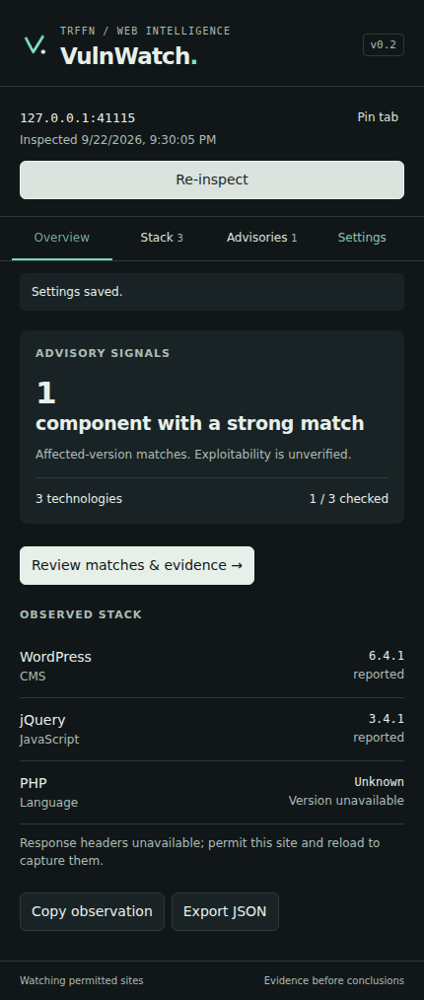

# Yes, I'm Lazy !!!!

### So I built TRFFN VulnWatch.

**Because copying a JavaScript version into another search tab for the 47th time is apparently called “a workflow.”**

Find the technology. Find the version. Look up the advisories. Forget which tab had the evidence. Repeat.

I wanted the browser to handle the repetitive part.

**VulnWatch is a passive Chrome extension that identifies exposed web technologies, checks supported package versions against known advisories, and shows the evidence behind its results.**

You browse. It observes. Strong matches get a badge. Everything else waits quietly in the inspector.

*Lazy about repetitive work. Particular about evidence.*

**v0.1.0 · Developer preview · Chrome 123+ · Manifest V3**

[Install](#install-before-your-coffee-gets-cold) · [Features](#what-it-actually-does) · [API keys](#bring-your-own-keys-or-dont) · [Privacy](#your-browsing-is-your-business) · [Limitations](#the-fine-print-except-its-readable)

---

## What it actually does

| Feature | The useful part |
| --- | --- |
| **Technology detection** | CMSs, exposed WordPress plugins and themes, JavaScript libraries, frameworks, and selected server/language signals. |
| **Version evidence** | Shows the runtime value, generator tag, asset path, or header behind a result. |
| **OSV advisory checks** | Checks supported npm package/version pairs without an API key. |
| **Quiet alerts** | Badges for strong, complete affected-version matches. Optional desktop notifications. |
| **Three ways to inspect** | Popup, side panel, or a popup with a panel shortcut. |
| **Light / Dark / Auto** | For daylight, late nights, and people who let their operating system decide. |
| **Automatic observation** | Opt in for selected websites or all permitted websites. Exclude origins whenever you want. |
| **Advisory refresh** | Daily, weekly, or manual refresh of cached OSV lookups. |
| **Research exports** | Copy observations or export JSON with evidence and advisory references. |
| **Noise controls** | Mute a particular advisory on a particular origin. Keep the evidence. Lose the interruption. |

The side panel can follow the active tab or stay pinned to one tab while you look something up elsewhere.

No account is required for the core extension. No build step is required to install it.

## It has a face, too

[Prefer the light version?](screenshots/overview-light.png)

*Screenshots use a local fixture and mocked advisory responses. They do not show a vulnerability discovered on a real website.*

## Install before your coffee gets cold

1. Download this repository using **Code → Download ZIP**, or clone it.
2. Extract it into a folder you intend to keep.
3. Open `chrome://extensions` in Chrome.
4. Enable **Developer mode**.
5. Click **Load unpacked**.
6. Select the **`extension`** folder — the one containing `manifest.json`.
7. Pin **TRFFN VulnWatch**, open a website, and click the extension icon.

That's it. You may now return to having too many tabs open.

**Automatic observation:** open **Settings → Observation & privacy**, choose **Allow this site** or **Allow all websites**, accept Chrome's permission prompt, and reload the website.

On-click inspection is the default. OSV checks are enabled by default and can be switched off for local detection without remote advisory lookups.

## Bring your own keys. Or don't.

The core OSV lookup works without one. Additional integrations are optional:

| Provider | What v0.1 uses it for | Key |
| --- | --- | --- |
| **OSV** | Automatic supported package/version checks; the source of badge matches | Not required |
| **WPScan** | On-demand WordPress core, plugin, and theme intelligence | Required; suitable provider plan needed |
| **GitHub Advisories** | On-demand secondary package/version checks | Optional for public advisory access |
| **NVD** | On-demand CVE descriptions and CVSS context | Optional |

Open **Settings → API keys** to save, replace, test, or remove a key. Choose **this browser session** or **this device** for storage. New keys are masked while entering them; saved keys are not displayed again.

Requests go directly from the extension's service worker to the selected provider. There is no VulnWatch backend in the middle.

**WPScan detail:** core lookups use the detected core version. Plugin and theme lookups return a component advisory list; v0.1 does not determine whether the installed version is affected. Those results are labelled accordingly, remain temporary, and do not generate badges or appear in exports.

GitHub and NVD secondary results are also temporary and do not change OSV badge counts.

Provider access and integration terms still apply. WPScan restricts caching/storage and specifies Enterprise accounts for company integrations; supplying your own key does not waive those terms. See [WPScan's API terms](https://wpscan.com/api/).

## A version match is a lead. Bring your brain.

VulnWatch separates what it observed from what it can conclude:

| Result | Meaning |
| --- | --- |
| **Reported** | A direct version claim was exposed. It can still be inaccurate or spoofed. |
| **Corroborated** | More than one strong signal agrees on the version. |
| **Inferred** | A filename or asset parameter suggests the version. No automatic alert. |
| **Unknown** | No acceptable version was exposed. |
| **Affected-version match** | An advisory includes the identified package/version. Exploitability is unverified. |
| **Unavailable / incomplete** | The lookup failed or coverage is incomplete. |

The extension does not establish whether an affected function is used, whether a patch was backported, or whether an issue qualifies for a bounty.

An empty advisory list means no matching records were returned by the completed checks. It does not mean “this website is secure.”

Your report still needs your research. Tragic, I know.

## Your browsing is your business

- Detection runs locally.
- OSV receives package names, ecosystems, and versions — **not visited URLs or page contents**. Providers still see your IP address.
- No telemetry, user account, or cloud synchronization.
- No cookie or Authorization-header collection.
- No guessed target paths, exploit probes, or extra target requests.
- Resource evidence excludes query strings and fragments.
- Page observations stay in the browser session and are removed when their tabs close or navigate.
- Preferences, explicit mutes/exclusions, and a bounded OSV cache persist locally. API keys persist only if you choose device storage.
- **Local key storage is not an encrypted vault.** Session-only storage is available, and keys never use Chrome sync.

Permissions support current-tab inspection, tab following, selected response-header observation, storage, the side panel, and refresh scheduling. Website access and desktop notifications are requested when you enable those features.

Use **Settings → Data & about** to clear observations, cache, and mutes while keeping your settings and keys.

## The fine print, except it's readable

This is the first version. Its coverage is deliberately explicit:

- **Top-level document only.** Child frames are not inspected.
- **Visible signals only.** Hidden server dependencies and libraries buried inside bundles may be missed.
- **Selected detection rules.** This is not an exhaustive inventory of the web.
- **Header access depends on permissions.** Reload after granting site access.
- **Late-loaded components may need Re-inspect.** Arbitrary DOM changes are not continuously monitored.
- **Server versions are inventory.** v0.1 does not perform CPE-based server vulnerability matching.
- **Chrome first.** There is no Firefox adapter in this release.

Mapped libraries include jQuery, Lodash, Underscore, Bootstrap, Moment.js, AngularJS, Angular, Vue, React, React DOM, Axios, D3, Handlebars, DOMPurify, Chart.js, Highlight.js, Backbone, SweetAlert2, and Marked.

Additional technology signals include WordPress, Drupal, Joomla, Ghost, Hugo, Wix, Squarespace, Shopify, Webflow, Next.js, Nuxt, PHP, nginx, Apache, IIS, Cloudflare, Express, and ASP.NET. Detection depends on what the page exposes.

## Updates, without the mystery

OSV responses are cached for 24 hours. Scheduled or manual refresh updates up to 20 oldest cached package/version lookups per run. **Re-inspect** requests fresh checks for the current page and updates its displayed observation.

Detection rules and executable code ship with the extension. **This unpacked release does not auto-install software updates:** download the next release and reload the updated extension in Chrome. A Store-distributed build would use browser-managed software updates.

No remotely downloaded JavaScript. No imaginary update server.

## Tested. With the boundaries written down.

**30 automated tests passed**, covering detection, uncertainty, advisory handling, alert filtering, key lifetime, message boundaries, and navigation during an inspection.

Browser UI checks exercised themes, evidence, muting, API key controls, permissions, export, and responsive layouts using simulated Chrome APIs and mocked provider responses.

**Still unverified in the build environment:** installing the package in regular Chrome, native popup/side-panel behavior, and live provider connectivity with real credentials.

See [validation details](docs/VALIDATION.md) and [test output](docs/test-results.txt).

Run `npm test` from the project root to execute the dependency-free logic tests with Node.js 20+.

The [local demo](examples/demo.html) exposes synthetic version signals without loading a vulnerable library. Serve the project folder locally to inspect it over HTTP.

## Found something wrong?

Open an issue with:

- Your Chrome and extension versions.
- What you expected and what happened.
- Minimal reproduction steps or a sanitized fixture.
- The relevant detection evidence, if it is safe to share.

Please leave API keys, cookies, private URLs, and other people's data out of the issue. They were not invited.

Useful contributions include better detection rules with fixtures, fewer false positives, clearer evidence, accessibility improvements, and documentation fixes.

---

**Built by [TrffnSec](https://github.com/TrffnSec).**

*Less tab archaeology. More actual research.*
